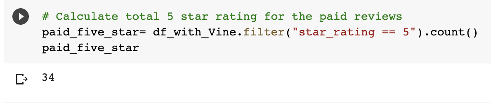

# Amazon Vine Analysis
## This project is part of the Data Analytics and Visualization Bootcamp at Northwestern University.
## Project Objective
To analyze Amazon reviews written by members of the paid Amazon Vine Program
## Methods Used
Natural Language Processing
Machine Learning
## Technologies
PySpark
AWS RDS
Pandas
ProgreSQL
## Project Description
This project analyzes Amazon reviews written by members of the paid Amazon Vine program. The Amazon Vine program is a service that allows manufacturers and publishers to receive reviews for their products. Companies like SellBy pay a small fee to Amazon and provide products to Amazon Vine members, who are then required to publish a review.
In this project, I make use of musical instruments datasets. It contains reviews of musical instruments. I used PySpark to perform the ETL process to extract the dataset, transform the data, connect to an AWS RDS instance, and load the transformed data into pgAdmin. Next, I used PySpark to determine any bias toward favorable reviews from Vine members in the dataset.

## Results
- There are 60 Vine reviews and 14477 non-Vine reviews in the datasets.
 
- 34 were 5 stars out of 60 Vine reviews while 8212 were 5 stars for non-Vine reviews.
 
- There were 56.67% of 5 star rating reviews of Vine while there were 56.72% of 5 star rating for non-Vine
 

## Summary
The analysis makes use of the paid and unpaid Vine column. There might be a bias of hasty generalization. The verified_purchases column should be used to ascertain that the people who reviewed the products are actual buyers of the product.

## Needs of this project
Natural Language Processing/ Cleaning
